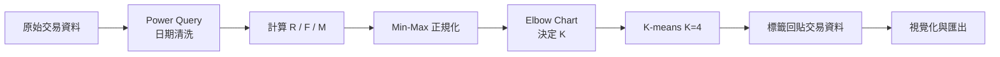

# 📈 RFM Customer Segmentation


> 以 RFM 模型與 K-means 對 732 位零售客戶分群,找出核心客群與流失風險客群,作為差異化行銷的依據。


## 📖 目錄

- [專案簡介](#-專案簡介)
- [關鍵成果](#-關鍵成果)
- [資料集](#-資料集)
- [方法](#-方法)
- [快速開始](#-快速開始)
- [結果](#-結果)
- [專案結構](#-專案結構)
- [限制與後續方向](#-限制與後續方向)
- [作者](#-作者)

## 🎯 專案簡介

並非所有客戶都值得投入同樣的行銷資源。本專案以三個行為指標描述每位客戶,再用非監督式學習自動分群:

| 指標 | 意義 | 計算方式 |
|---|---|---|
| **R**ecency | 最近一次購買距今多久 | 資料中最晚日期 − 客戶最後購買日(天) |
| **F**requency | 購買頻率 | 以 `InvoNo` 計數 |
| **M**onetary | 消費金額 | `Amount` 加總 |

## 🏆 關鍵成果

- 732 位客戶被分為 **4 個群組**,各群特徵差異明顯
- **High 群(約 18% 客戶)貢獻約 41% 營收**,平均每人購買 26 次、消費約 74,067
- **Missing 群(約 10% 客戶)** 平均已 184 天未購買,屬流失風險客群
- 分群結果已回貼至每筆交易,可直接用於 Excel / BI 工具後續分析

## 🗂️ 資料集

- **來源**:SalesRecord,2018 年交易紀錄(已去識別化 / 僅提供範例資料)
- **交易層級欄位**:

| 欄位 | 說明 |
|---|---|
| `Date` | 交易日期 |
| `InvoNo` | 發票編號 |
| `CustomerKey` | 客戶代碼 |
| `Amount` | 交易金額 |

- **客戶層級欄位**(`RFM_DATA.csv`):`Coustomer`、`F`、`M`、`R`

> 原始資料含客戶代碼與發票編號,未公開。倉庫僅附範例資料,請以自己的交易資料替換。

## 🔬 方法



1. **資料清洗**:在 Power Query 將 `yyyyMMdd` 數字格式轉為日期型別
2. **特徵計算**:依 `CustomerKey` 分組,計算 R、F、M
3. **正規化**:Min-Max Scaling,將三個指標縮放至 0~1,避免金額量級主導距離計算
4. **選擇 K**:繪製 Elbow Chart,K = 2 之後下降趨緩,拐點落在 2~4,考量業務解釋性選擇 **K = 4**
5. **分群**:`KMeans(n_clusters=4, random_state=42, n_init='auto')`
6. **標籤回貼**:將 Cluster 合併回原始交易資料並對應為 Group
7. **視覺化**:以 Group 分組繪製 R、F、M 成對散布圖

核心程式碼:

```python
from sklearn.preprocessing import MinMaxScaler
from sklearn.cluster import KMeans

nrfm = rfm_data.copy()
nrfm[['F', 'M', 'R']] = MinMaxScaler().fit_transform(nrfm[['F', 'M', 'R']])

kmeans = KMeans(n_clusters=4, random_state=42, n_init='auto')
nrfm['Cluster'] = kmeans.fit_predict(nrfm[['F', 'M', 'R']])
rfm_data['Cluster'] = nrfm['Cluster']
```

完整流程請見 [`rfm_analysis.ipynb`](rfm_analysis.ipynb)。

### 🛠️ 開發流程

使用 Google AI Studio 產生 RFM 轉換程式碼,於 Jupyter Notebook 整合與驗證,並在 Google Colab 中以自然語言指令完成正規化、分群與視覺化。

## 🚀 快速開始

```bash
git clone https://github.com/<your-username>/<repo-name>.git
cd <repo-name>
pip install pandas scikit-learn matplotlib seaborn
jupyter notebook rfm_analysis.ipynb
```

請將 notebook 中的資料路徑改為你自己的檔案。輸入資料需包含 `Date`、`InvoNo`、`CustomerKey`、`Amount` 四個欄位。

## 📊 結果

| Cluster | Group | 人數 | 占客戶比 | 占營收比* | 平均 F | 平均 M | 平均 R(天) | 輪廓 |
|---|---|---|---|---|---|---|---|---|
| 1 | High | 131 | 17.9% | ~40.6% | 26.02 | 74,066.83 | 14.79 | 最頻繁、貢獻最高、近期活躍 |
| 2 | Low | 212 | 29.0% | ~39.0% | 18.64 | 44,033.34 | 18.43 | 頻率與金額中上、近期活躍 |
| 3 | Medium | 314 | 42.9% | ~17.7% | 5.57 | 13,517.75 | 45.25 | 頻率與金額偏低,可再活化 |
| 0 | Missing | 75 | 10.2% | ~2.7% | 3.64 | 8,586.61 | 183.65 | 購買少、金額低、久未回購 |

\* 以各群人數 × 平均 M 推算。

### 💡 行銷建議

| 群組 | 策略 |
|---|---|
| High | 優先維護:會員專屬優惠、新品優先體驗 |
| Low / Medium | 依頻率與金額設計升級誘因,提高回購 |
| Missing | 喚回活動:折扣券、關懷訊息 |

## 📁 專案結構

```
.
├── README.md
├── .gitignore
├── rfm_analysis.ipynb      # 完整分析流程
├── data/
│   └── sample.csv          # 去識別化範例資料
├── images/
│   └── RFM_Pairplot.png    # 成對散布圖
└── RFM_result.csv          # 含 Cluster / Group 的結果檔(視隱私決定是否公開)
```

## ⚠️ 限制與後續方向

- 分群僅反映 2018 年單一期間的行為,未考慮季節性
- K-means 對離群值敏感,可評估 log 轉換或穩健縮放
- 可加入輪廓係數(Silhouette Score)等指標驗證 K 值
- 可延伸為定期更新的 Power BI 儀表板

## 👤 作者
